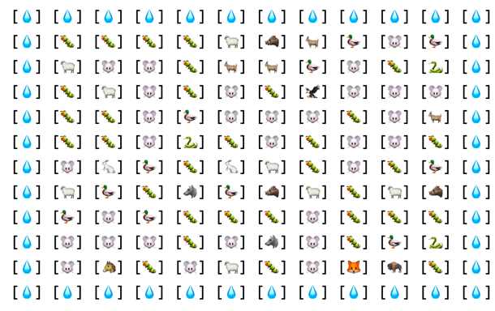
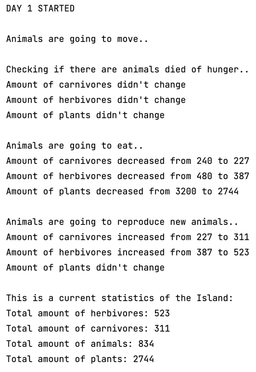

# javarush-island  

## Краткое описание  

Приложение симулирует жизнь животных и растений на острове размером 100х20 клеток. 
Каждая локация заполнена растительностью, хищниками и травоядными. Жизнь на острове длится 10 дней.  

Животные могут:  
- передвигаться: каждый тип животного имеет свою скорость передвижения по острову. 
- есть растения и/или других животных (если в их локации есть подходящая еда).
- размножаться (при наличии пары в текущей локации).
- умирать от голода или быть съеденными.

Растения могут:
- восстанавливаться за ночь перед новым днем. 

>Пример того, как выглядит остров размером 10х10:  
> 
>

Запуск проекта:  

>java -jar ./javarush-island.jar 

# Краткое описание классов

В корневом пакете проекта `ru.javarush.akursekova.islandtask` находится класс Application, содержащий в себе точку входа в приложение.  

В классе Application вызывается метод run() объекта класса ProcessManager, который управляет основными процессами жизни на острове:
- движение животных
- уменьшение их сытости после передвижения
- употребление пищи
- размножение
- восстановление растительности

В пакете `animals` содержатся пакеты, описывающие иерархию классов животных:

- `abstracts`: пакет с абстрактными классами: 
    - `Animal`: описывает общие поля и методы, принадлежащие всем животным, наследующим этот класс.
      - метод `reduceFullness`: уменьшает сытость животного на четверть от максимальной сытости после того, как животное сделало ход.
      - метод `increaseFullness`: увеличивает сытость животного на количество килограмм, равное весу съеденного животное или увеличивает сытость до максимума, если вес съеденного животного больше максимальной сытости.
      - метод `generateDirectionsToMove`: генерирует направления движения для будущего хода животного.
    - `Carnivore`: класс, наследуемый всеми хищниками. 
    - `Herbivore`: класс, наследуемый всеми травоядными.
- `carnivore`: пакет с классами, описывающих хищных животных. 
- `herbivore`: пакет с классами, описывающих травоядных животных.
- `plants`: пакет с классом, описывающий растительность острова.
- `Viable`: интерфейс, используемый как маркер, с целью объединить в общий список растения и животных.

В пакете `settings` содержатся два класса:
- `FoodAndProbabilityRules`: класс, который хранит информацию каких животных (или растения) и с какой вероятностью может съесть каждое животное.
- `GameSettings`: класс, который хранит настройки острова: длину, ширину, количество дней жизни на острове.

Также в корневом пакете проекта `ru.javarush.akursekova.islandtask` находится класс `Island`, хранящий в себе:
- внутренний класс `Location`, который хранит в себе:
  - Позицию на острове
  - Список всех животных, находящихся в текущей локации
  - Map, в которой хранится количество животных по классам
- настройки острова: его длину и ширину
- информацию о том, какое максимальное количество животных каждого вида может находиться в каждой локации
- информацию о максимуме растений в каждой локации

В классе `Island` описаны следующие методы: 
1. `moveAnimals`: метод, двигающий животных по локациям острова.  

Каждое животное за ход проходит количество клеток, равное значению поля `speed`.  
Далее генератором случайных чисел подбираются числа по количеству, равному скорости животного в периоде от 1 до 4 включительно.  
Каждому числу соответствует определенное направление, куда будет перемещаться животное: 
- 1 = лево
- 2 = право
- 3 = вверх
- 4 = вниз  

>**Например:**  
>Скорость Волка = 3.  
>Генератором случайных чисел подбирается 3 числа, например: 3, 4, 1.  
>Это означает, что за один ход волк из своей текущей локации перейдет на локацию 
>- вверх
>- вниз (вернется на исходную локацию) и 
>- влево.

Метод `moveAnimals` использует вспомогательные методы: 

- `buildBorderAroundIsland`: выстраивает по периметру острова "границу" и заполняет ее значением null. Если животное для следующего хода выбрало локацию, которая является границей, ход не будет совершен животным и оно останется на своей текущей локации.
- `locationIsOnBorder`: метод проверяет, является ли локация граничной или нет.
- `animalAmountExceedsLimit`: метод проверяет количество животных в локации, в которую хочет переместиться животное. Если лимит будет превышен, то животное не совершит ход и останется на своей текущей локации.

За один день животное двигается только один раз.

2. `becomeHungryAfterMovement`: метод, уменьшающий сытость животных после их перемещения из одной локации в другую.

3. `massCleanUpDiedAnimals`: метод, удаляющий с острова животных, которые умерли от голода. 

4. `feedAnimals`: метод, описывающий как питаются животные.
В методе проверяется, может ли одно животное съесть другое животное, находящееся на той же локации. Будет ли животное съедено или нет определяет генератор случайных чисел.  

>**Например:**  
>Вероятность, что Волк съест Козу = 60. Генерируется случайное число в периоде от 0 до 100 включительно.  
>- Если сгенерированное число меньше или равно вероятности быть съеденным (например, 50), то Волк съедает Козу. 
>- Если сгенерированное число больше вероятности быть съеденным (например, 80), то Волк не съедает Козу.

Если одно животное съедает другое животное, то съеденное животное умирает (удаляется из локации), а животному, которое поело, увеличивают сытость. 
Не зависимо от того удалось ли животному поесть или нет, ему проставляется флаг TriedToEat = true. Животное не может повторно поесть до следующего дня.

5. `reproduceNewAnimal`: метод, описывающий процесс воспроизведения потомства. 
Животное может размножаться один раз за день. Если в локации, в которой находится животное, есть другое животное того же класса, то создается новое животное и помещается в ту же локацию. 

6. `recoverPlants`: метод, восстанавливающий растения на локации до заданного максимума. 
7. `resetFlags`: метод, сбрасывающий все флаги (moved, triedToEat, fertile) к исходному состоянию перед началом нового дня на острове.

В корневом пакете проекта `ru.javarush.akursekova.islandtask` содержится класс `Position`.  
`Position` описывает позицию на острове. Имеет координаты х и у.

В пакете `service` находятся классы:  
- `AnimalsInitialization`, ответственный за инициализацию животных и растений на всем острове.   
Сколько животных каждого типа будет создано на каждой локации определяется генератором случайных чисел. Случайное число не превышает максимум, установленный для каждого класса животного.  
- `RandomNumberGenerator`: генерирует случайные числа в указанном периоде.
- `ConsoleWriter`: выводит в консоль вид острова и статистические данные.
- `ProcessManager`: класс, который поочередно вызывает все основные методы управления животными (передвижение, питание, размножение).

В пакете `counter` находятся два класса:
- `PopulationCounter`: статический класс-счетчик популяции на острове.
- `StatisticsCounter`: класс, ведущий статистику. Содержит 2 метода `start` и `finish`. 
Логика работы заключается в том, что метод, после работы которого нам интересно узнать изменения в популяции, должен запускаться между методами start и finish.
Метод start запоминает данные популяции до выполнения метода, а метод finish высчитает разницу между старым значением и новым.

>Пример, как отображается статистика:  
> 
>

В пакете `ru.javarush.akursekova.islandtask.logging` содержится класс  
`Logger`: утилитный класс, с помощью которого собираются логи во время работы приложения. В классе описаны три уровня: info, debug, error. 
Но на деле используются только два из них: info и debug. Уровень error не используется. В данной проекте используется не готовое решение Java класса Logger, а вручную написанный класс. 

***Замечание***
Когда проект запускается с размером острова 100х20, то из-за логера производительность работы приложения падает, потому что в output.log регистрируется очень много записей.
Во время разработки приложения я использовала логер на меньшем размере поля с меньшим количеством животных, поэтому это не отражалось на производительности.
Оставила логер в проекте с целью продемонстрировать мою работу с ним. 

В пакете `ru.javarush.akursekova.islandtask.exception` содержатся классы
- `AnimalCreationException`: класс, отвечающий за обработку ошибок при попытке создания нового животного.
- `LoggerInitializationException`: класс, отвечающий за обработку ошибок при попытке создания объекта класса Logger.
